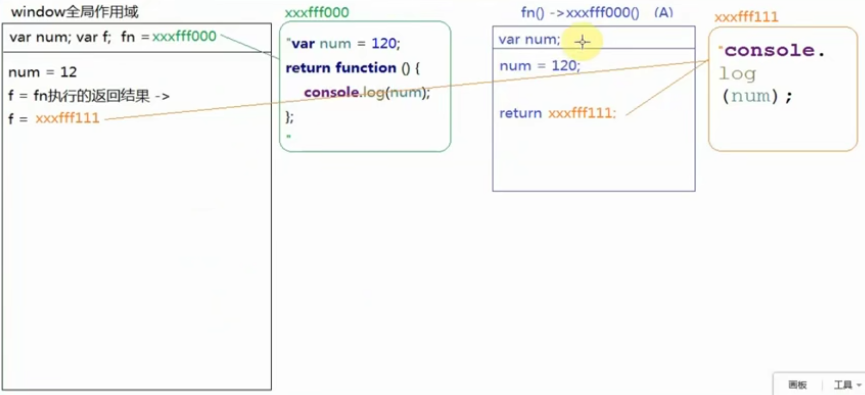

## 预解释和作用域
### 1.如何区分私有变量和全局变量
*  在全局作用域下声明（预解释的时候）的变量是全局变量；
*  在"私有作用域中声明的变量"和"函数的形参"都是私有的变量；
>  在私有作用域中，我们代码执行的时候遇到了一个变量，首先我们需要确定他是否为私有的变量，如果是私有变量，那么和外面没有任何关系；如果不是私有的，则往当前作用域的上级作用域进行查找，如果上级作用域也没有则继续查找，直到window为止（作用域链）
### 2.当函数执行的时候（直接目的：让函数体中的代码执行），首先会形成一个新的私有作用域，然后按照如下的步骤执行：
>- 如果有形参，先给形参赋值；
>- 进行私有作用域中的预解释；
>- 私有作用域中的代码从上到下执行；
>- 函数形成一个新的私有的作用域保护了里面的私有变量不受外界的干扰（外面修改不了私有的，私有的也修改不了外面的）--> **闭包**

### 3.匿名函数之函数表达式：把函数定义的部分当做一个值赋值给我们的变量/元素的某一个事件
```
fn(); //在这里执行会报错；fn not a function
var fn = function(){
    console.log("ok")
}
```
### 4.自执行函数：定义和执行一起完成(不进行预解释)
```
(
  function(num){
  
  }
)(100)
```
### 5.函数体中return下面的代码虽然不执行了，但是需要进行预解释；return后面跟着的都是我们返回的值，所以不进行预解释
```
function fn(){
  //预解释：var num
  console.log(num);
  return function(){
  
  };
  var num = 100;
}
fn();
```
### 6.在js中如果变量的名字和函数的名字重复了，也算冲突
```
fn();                           //  2
function fn(){console.log(1);};
fn();                           // 2
var fn = 10;                    // fn = 10
fn();                           // 10()  报错 fn is not a function   
function fn(){console.log(2);};
fn();                           //不再执行
```
## 如何查找上级作用域
### 1.看当前函数是在哪个作用域下定义的，那么它的上级作用域就是谁（和函数在哪执行没有任何关系）
```
var num = 12;
function fn(){
   var num = 120;
   return function (){
     console.log(num);
   };
};
var f = fn();
f();                    // 120

~function(){
   var num = 1200;
   f();                   // 120
}();
```
